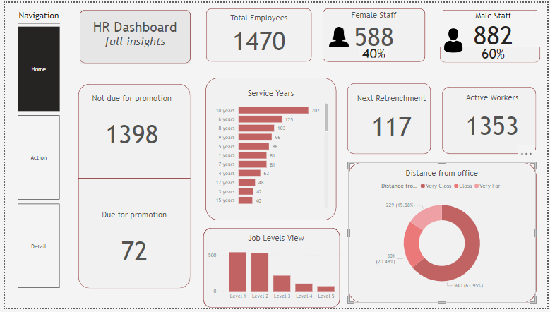

# Tolani Oyewole Portfolio
[Project 1 : Oxford Community Survey](https://github.com/Aratola/aratola.github.io)

The Power BI dashboard summarizes the health metrics of adolescents in Oxford community based on a comprehensive survey. It focuses on key indicators such as weight, BMI, and classifications like obesity and thinness. The dashboard offers a visually appealing and informative snapshot of the health status of adolescents, empowering users to quickly grasp and analyze important trends. It's a powerful tool for promoting community health awareness and guiding targeted interventions where needed. 

[Project 2 : HR Dashboard](https://github.com/Aratola/aratola.github.io)

This dashboard shows

