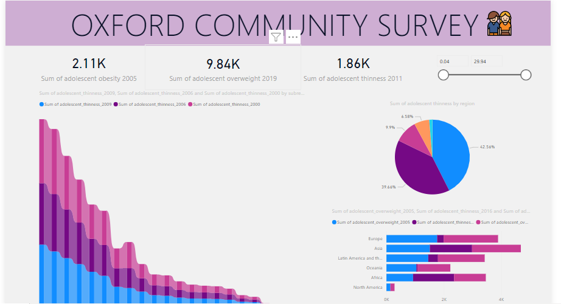

# Tolani Oyewole Portfolio
[Project 1 : Oxford Community Survey](https://github.com/Aratola/aratola.github.io)

The Power BI dashboard summarizes the health metrics of adolescents in Oxford community based on a comprehensive survey. It focuses on key indicators such as weight, BMI, and classifications like obesity and thinness. The dashboard offers a visually appealing and informative snapshot of the health status of adolescents, empowering users to quickly grasp and analyze important trends. It's a powerful tool for promoting community health awareness and guiding targeted interventions where needed. 

[Project 2 : HR Dashboard](https://github.com/Aratola/aratola.github.io)

Welcome to the comprehensive HR Insights Power BI dashboard, offering a 360-degree view of our workforce. This dynamic presentation encapsulates key elements: gender distribution, illustrating the percentage of female and male staff; the geographical spread, mapping the distance of our workforce from the office; a strategic overview of retirement eligibility, distinguishing those due for retirement and those not; a snapshot of job levels to gauge organizational hierarchy; and a targeted focus on career development, highlighting employees due for promotion and those not in line for advancement. With a lens on service years, this dashboard paints a vivid picture of our diverse and evolving workforce, providing actionable insights for strategic HR decision-making.

[Project 3 : Prime Health Insurance Dashboard](https://github.com/Aratola/aratola.github.io)
k

![
